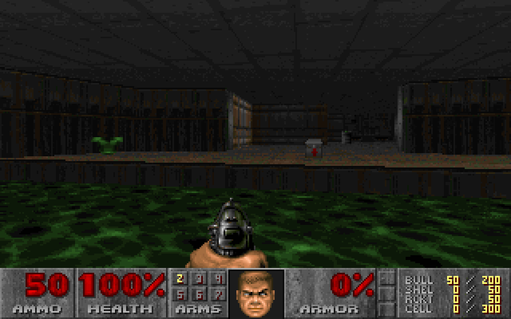
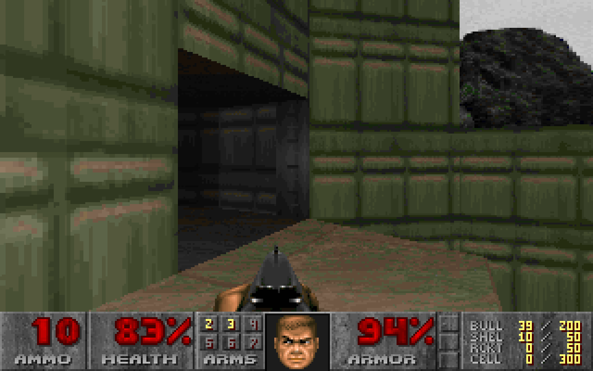

<h1 align="center">
  <picture>
    
  </picture>
  <br />
  claude-doom
</h1>

<p align="center">
  🇬🇧 English &nbsp;•&nbsp; <a href="docs/i18n/README.es.md">🇪🇸 Español</a>
</p>

<h4 align="center">
  Real DOOM (doomgeneric WASM) inside <a href="https://claude.com/claude-code">Claude Code</a>'s statusline —
  fire while Claude works, attract-mode DOOM when you're AFK, pixel-perfect fullscreen play in iTerm2/kitty.
</h4>

<p align="center">
  <a href="LICENSE"></a>
  
  = 20" />
  
  = 2.1.153" />
</p>

<br />

<p align="center">
  <table align="center">
    <tr>
      <td align="center">
        
        <br />
        <em>Pixel-perfect mode — real 1280×800 PNG frames via terminal graphics protocols</em>
      </td>
      <td align="center">
        
        <br />
        <em>PSX fire ambient banner</em>
      </td>
    </tr>
  </table>
</p>

---

## Quick Start

```sh
# 1. Add the marketplace and install the plugin
claude plugin marketplace add ezequielmm/claude-doom
claude plugin install afk-arcade@afk-arcade-marketplace

# 2. Add the statusLine entry to ~/.claude/settings.json
```

```json
{
  "statusLine": {
    "command": "bash ~/.claude/afk-arcade/statusline.sh",
    "refreshIntervalMs": 1000
  }
}
```

```sh
# 3. Fetch the DOOM engine (GPL-2.0 — downloaded separately, never bundled)
node <plugin>/scripts/fetch-doom.mjs

# 4. Restart Claude Code
```

> The `SessionStart` hook writes `~/.claude/afk-arcade/statusline.sh` automatically on first launch. No manual shim setup required.

---

## The Three Modes

### 1. Statusline banner

The banner lives in Claude Code's status row and responds to the editor's event stream via a hook state machine:

| Event | State | Visual |
|---|---|---|
| `UserPromptSubmit` | `working` | Full fire / DOOM rolling |
| `Stop` / `StopFailure` | `idle` | Embers — "done, waiting for you" |
| `Notification: idle_prompt` | `afk` | DOOM attract-mode demo |
| `Notification: permission_prompt` | `attention` | Yellow warning HUD flash |

Switch between the fire effect (`/afk game fire`) and the live DOOM daemon (`/afk game doom`) at any time.

### 2. Fullscreen half-blocks

Play DOOM interactively, using Unicode half-block characters (`▀`) to render every frame in any 256-color terminal:

```sh
node scripts/play.mjs
```

Controls: `WASD` / arrow keys to move, `SPACE` to open doors, `F` to fire, `1`–`7` to switch weapons, `ESC` for menu, `Q` or `Ctrl+C` to quit.

### 3. Pixel-perfect mode

Real 1280×800 PNG frames streamed at adaptive fps via native terminal graphics protocols:

```sh
node scripts/play.mjs --gfx auto
```

The `--gfx auto` flag detects your terminal and picks the best protocol. Use `--res half` for 640×400 if your connection is slow.

| Terminal | Support |
|---|---|
| iTerm2 | Full (iTerm2 inline images) |
| kitty | Full (Kitty graphics protocol) |
| WezTerm | Full (iTerm2 inline images) |
| Apple Terminal | Half-blocks fallback |
| Warp | Half-blocks fallback |

---

## How It Works

```
┌──────────────────────────────────────────────────────────────────┐
│ Claude Code                                                        │
│                                                                    │
│  hooks ──► hook.mjs (state machine)                               │
│              writes ~/.claude/afk-arcade/{config,runtime}.json    │
│              writes /tmp/afk-arcade/sessions/<id>.json            │
│              SIGTERM → daemon (SessionEnd cleanup)                │
│                                                                    │
│  statusLine ──► statusline.mjs (1 fps poll)                       │
│                   reads session state                              │
│                   reads frame.ans  ◄── daemon.mjs                 │
│                   if stale → spawns daemon (detached, auto-exits) │
│                   renders half-blocks or passes through to        │
│                   terminal graphics protocol                      │
│                                                                    │
│  /afk ──► afk-ctl.mjs                                             │
└──────────────────────────────────────────────────────────────────┘
```

`daemon.mjs` runs doomgeneric compiled to WebAssembly in a detached Node.js process. Every ~1 s it reads `viewport.json` (terminal dimensions from the statusline), scales DOOM's 320×200 framebuffer through a box filter to the current banner size, and writes `frame.ans` atomically. A pidfile guards against double-spawning. The daemon self-terminates after 10 minutes of no viewport updates, or immediately on `SessionEnd`.

`play.mjs --gfx auto` bypasses the half-block renderer entirely: it reads the raw RGB framebuffer, zero-dependency-encodes it to PNG, and streams it to the terminal using the appropriate inline-image escape sequence at adaptive fps.

---

## Commands

| Command | Description |
|---|---|
| `/afk status` | Show config and active session modes |
| `/afk on` / `/afk off` | Toggle the banner |
| `/afk game fire` | DOOM PSX fire effect (default) |
| `/afk game doom` | DOOM WASM daemon frames (auto-spawns daemon) |
| `/afk rows <N>` | Banner height, 2–30 rows |
| `/afk aspect <4:3\|16:10\|stretch>` | Frame aspect ratio (default: `4:3`) |
| `/afk play` | Print the fullscreen play command |
| `/afk fetch-doom` | Download DOOM WASM assets into `vendor/` |

---

## Configuration

`~/.claude/afk-arcade/config.json` is written on first `SessionStart` and persists across restarts.

| Key | Default | Description |
|---|---|---|
| `enabled` | `true` | Master on/off switch |
| `game` | `"fire"` | Active game mode (`fire` or `doom`) |
| `rows` | `5` | Banner height in terminal rows |
| `aspect` | `"4:3"` | DOOM frame aspect ratio |

Edit the file directly or use `/afk` commands — they write through immediately.

---

## System Requirements

- **Node.js** >= 20
- **Claude Code** >= 2.1.153
- **Terminal** — truecolor recommended (256-color fallback is automatic)
- **Pixel-perfect mode** — requires iTerm2, kitty, or WezTerm

---

## Troubleshooting

**No banner in the statusline**
Run `claude plugin list` and confirm `afk-arcade` is active. Check that `statusLine.command` in your settings points to `~/.claude/afk-arcade/statusline.sh`.

**"doom: daemon offline" or "doom: warming up"**
The daemon needs a few seconds to start. If it stays offline, check that DOOM assets are present:
```sh
node scripts/fetch-doom.mjs
```

**Assets missing / fetch fails**
`fetch-doom.mjs` downloads from the `opentui-doom` npm package registry (no npm install — it uses the CDN tarball directly). Check your network connection and retry.

**Run the test suite**
```sh
node test/run.mjs
```

DOOM-specific tests skip automatically when `vendor/doom/` assets are absent.

---

## Roadmap

See [ROADMAP.md](./ROADMAP.md) for the full plan — including NES and Game Boy emulators and a wide-banner Game SDK for building status-row games.

---

## Development

```sh
# Run the full test suite (DOOM tests skip cleanly if assets are absent)
node test/run.mjs

# Run the graphics protocol tests
node test/gfx.test.mjs

# Generate new captures from a running daemon
node scripts/capture.mjs
```

---

## Contributing

Bug reports and feature requests are welcome via [GitHub Issues](https://github.com/ezequielmm/claude-doom/issues).

Pull requests should:
- Keep the zero-dependency constraint (no `node_modules`, no `package.json` deps)
- Pass `node test/run.mjs` before submitting
- Follow conventional commits (`feat:`, `fix:`, `chore:`, `docs:`)

---

## License & Credits

This plugin's code is released under the [MIT License](./LICENSE).

**Important legal notice:** The doomgeneric engine (GPL-2.0, by [ozkl](https://github.com/ozkl/doomgeneric)) and the DOOM shareware WAD (`doom1.wad`) are **downloaded separately** by `scripts/fetch-doom.mjs` and are **never bundled or committed** to this repository. The prebuilt WASM binary is sourced from the [opentui-doom](https://www.npmjs.com/package/opentui-doom) npm package. DOOM is a registered trademark of id Software, LLC.

---

<p align="center">
  Made with care by <strong>Gentleman Programming</strong>
  <br />
  If this made your terminal more fun, consider giving it a ⭐ on <a href="https://github.com/ezequielmm/claude-doom">GitHub</a>.
</p>
